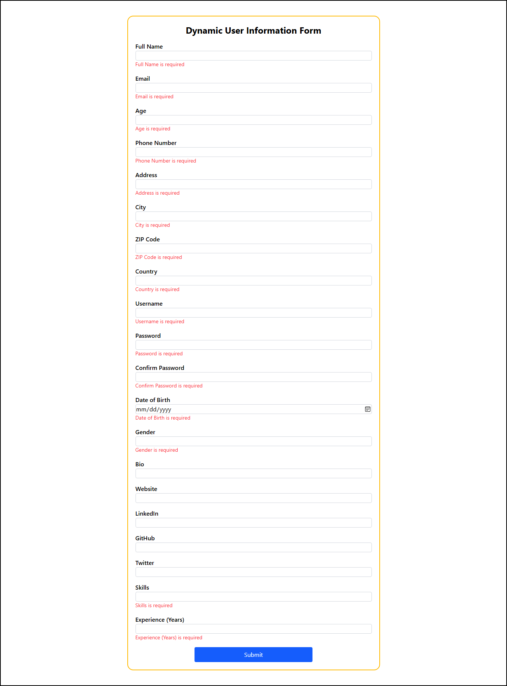

# WebMaster-internship-smart-dynamic-form-react

This project was created as part of the **Web Master Frontend Internship** to complete Task #4: *"The Evil Manager and the Long Form"*.

## 📌 Project Description

A smart and dynamic registration form built with **React**, **Formik**, **Yup**, and styled using **Tailwind CSS**.  
The form contains **20 input fields**, each with proper validation — **but without writing 20 separate validations manually!**

## 🚀 Live Demo

https://bespoke-swan-65ca60.netlify.app/

---

## ⚙️ Technologies Used

- React
- Vite
- Formik
- Yup
- Tailwind CSS
- JavaScript (ES6+)

---

## 💡 Smart Trick Used

Instead of building and validating each of the 20 fields manually, I used a **dynamic configuration object (array of fields)** with the following benefits:

- ✅ Auto-generates form inputs using `.map()`
- ✅ Centralized validation schema using **Yup** and mapped with field names
- ✅ Easily extendable — just add a new field in the config array
- ✅ Clean, reusable code structure

This approach saved time and made the form more scalable and maintainable.

---

## 📷 Screenshot


---

## 🧑‍💻 How to Run Locally

```bash
git clone https://github.com/your-username/WebMaster-internship-smart-dynamic-form-react.git
cd WebMaster-internship-smart-dynamic-form-react
npm install
npm run dev